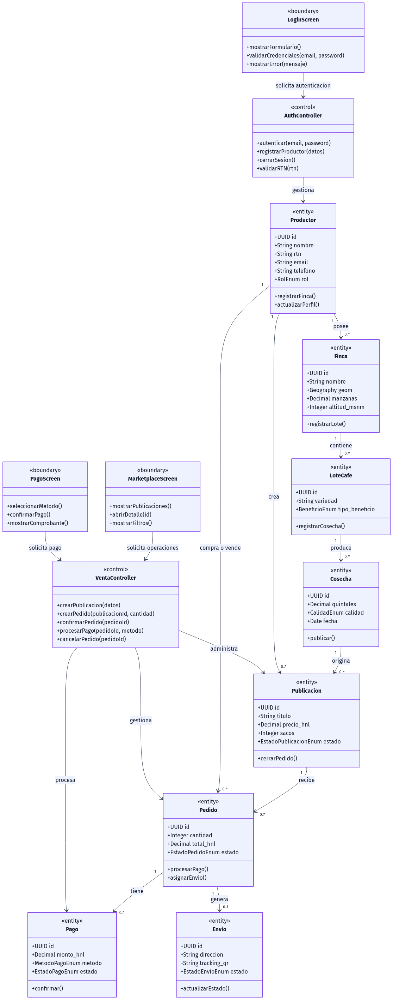
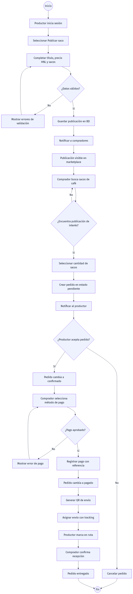
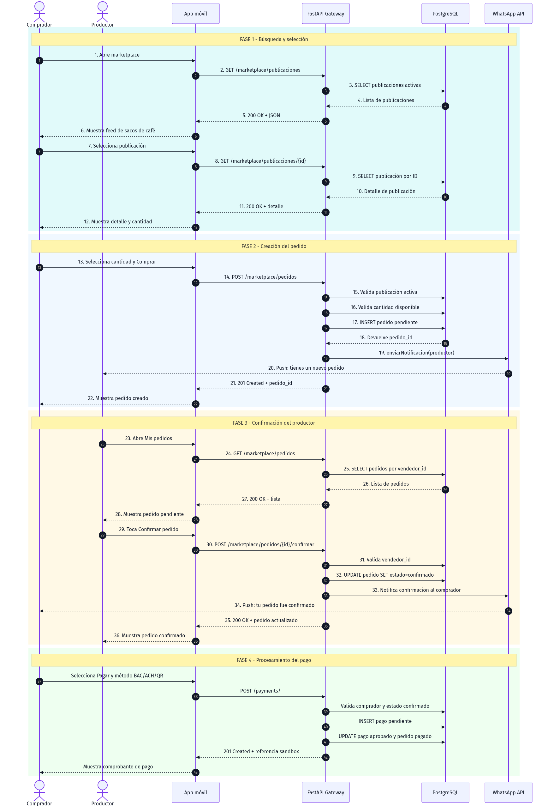
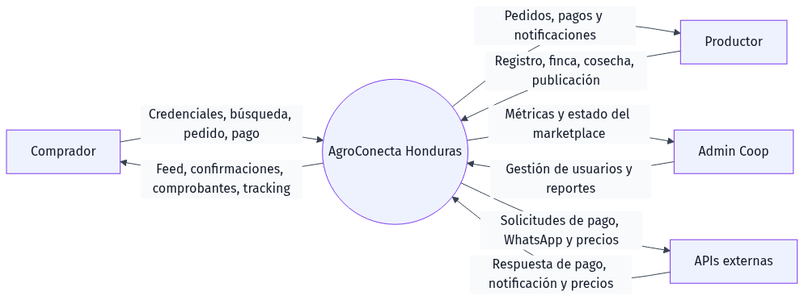
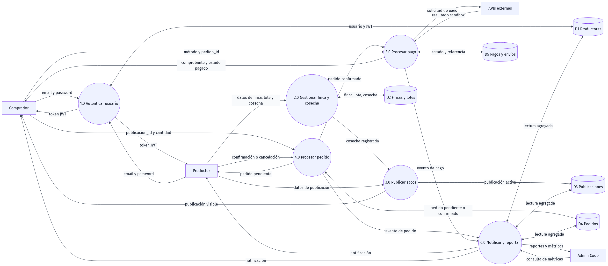
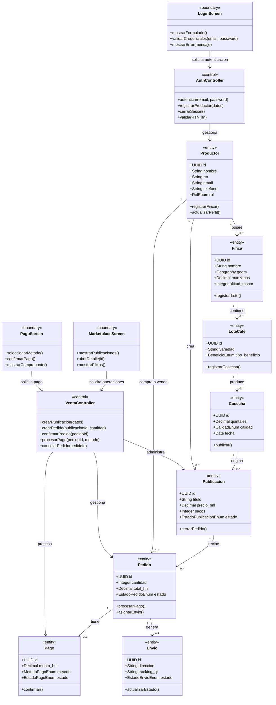
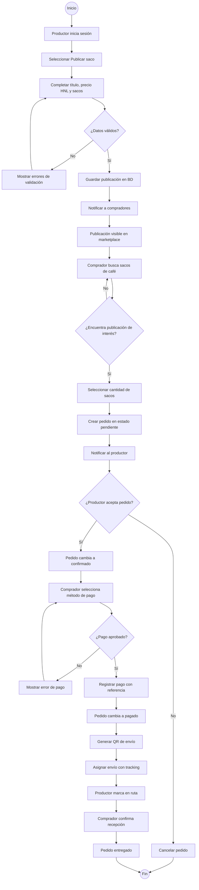
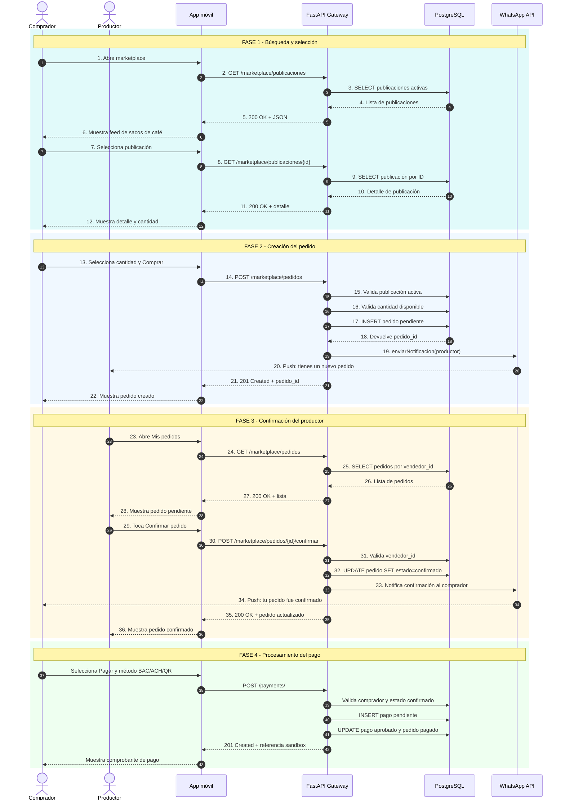
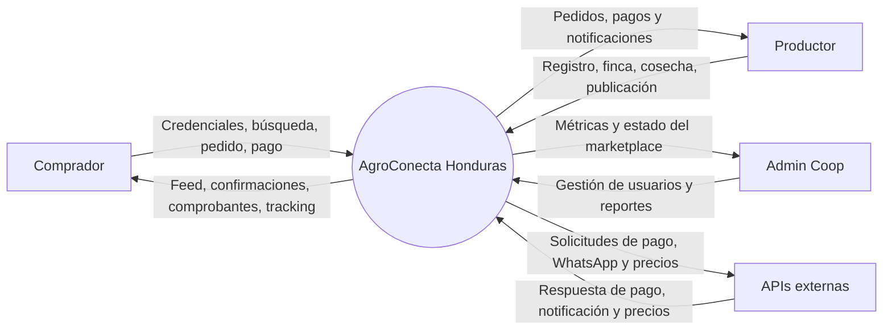
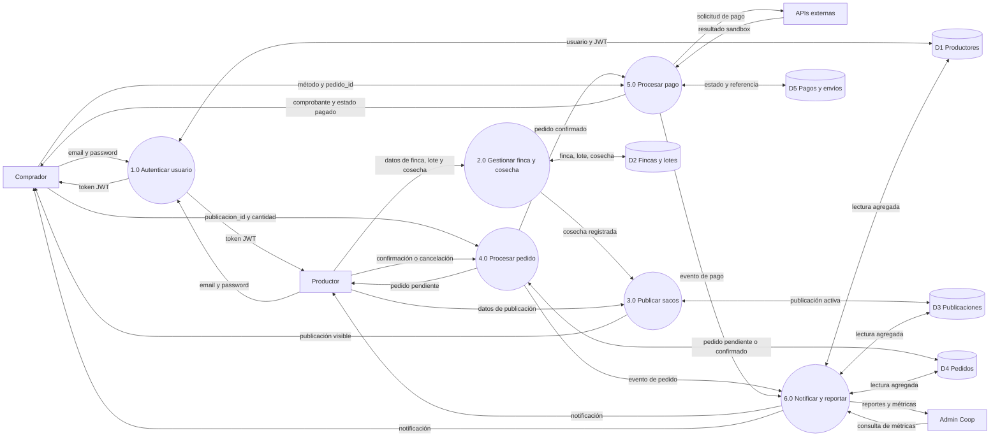

# AgroConecta Honduras
## Diagramas UML y flujo de datos del sistema

**Ingeniería de Software I**  
**CEUTEC · Sección 69**  
**Catedrático:** Ing. Mario Roberto Nones Melgar  
**Estudiante:** Eduardo Orellana · Cuenta 62111505  
**Versión:** 3.0 · 2026

---

## Lo que contiene el documento

### 4 Diagramas UML profesionales (basados en los capítulos del curso)

| # | Diagrama | Capítulo | Perspectiva |
|---|---|---|---|
| 1 | Modelo de Clases de Análisis | Cap. 6 — Arlow/Neustadt | Estructura estática con patrón Entity-Control-Boundary |
| 2 | Diagrama de Actividad | Cap. 6 — Arlow/Neustadt | Flujo de trabajo completo de venta de café |
| 3 | Diagrama de Secuencia | Cap. 7 — Pressman | Interacción temporal con 4 fases y 36 mensajes |
| 4 | DFD Nivel 0 y Nivel 1 | Cap. 7 — Pressman | Flujo de datos con 6 procesos y 5 datastores |

## Estructura del documento

1. **Portada** — estilo Deep Cyan con los datos académicos del proyecto.
2. **Sección 1: Introducción** — resumen y mapeo a fases del Proceso Unificado.
3. **Sección 2: Modelo de Clases** — Figura 1, diccionario de 13 clases y reglas de oro aplicadas.
4. **Sección 3: Diagrama de Actividad** — Figura 2, elementos, 5 fases y caminos alternativos.
5. **Sección 4: Diagrama de Secuencia** — Figura 3, 6 participantes, 4 fases y mensajes clave.
6. **Sección 5: DFD Nivel 0 y 1** — Figura 4, actores, 6 procesos, 5 datastores y lineamientos.

> Los diagramas están escritos en Mermaid para que puedan renderizarse en GitHub, VS Code con una extensión Mermaid o cualquier visor compatible. Los bloques se mantienen como fuente editable para facilitar futuras entregas.

## Galería visual de diagramas

Las figuras también están disponibles como imágenes PNG listas para visualizar o insertar en una exposición/documento:

### Figura 1. Modelo de Clases de Análisis

### Figura 2. Diagrama de Actividad

### Figura 3. Diagrama de Secuencia

### Figura 4. DFD Nivel 0 - Diagrama de contexto

### Figura 5. DFD Nivel 1 - Descomposición funcional

---

## 1. Introducción

AgroConecta Honduras es un marketplace móvil que conecta caficultores y compradores para publicar, buscar, comprar y pagar sacos de café. El sistema está implementado con Flutter en el cliente móvil, FastAPI como gateway y servicios de dominio, y PostgreSQL/PostGIS como persistencia principal.

El modelo documenta el flujo principal de negocio: un productor publica una cosecha, un comprador crea un pedido, el productor lo confirma y el comprador procesa un pago en sandbox. Las notificaciones y el envío completan el seguimiento posterior del pedido.

### Mapeo al Proceso Unificado

| Fase | Aplicación en AgroConecta |
|---|---|
| Inicio | Identificación del problema comercial y de los actores: productor, comprador y cooperativa. |
| Elaboración | Diseño de entidades, reglas de negocio, API Gateway, base de datos y diagramas UML. |
| Construcción | Desarrollo de Flutter, FastAPI, autenticación JWT, marketplace, pedidos y pagos sandbox. |
| Transición | Validación en emulador Android, documentación, pruebas de endpoints y preparación para despliegue. |

---

## 2. Modelo de Clases de Análisis

**Figura 1.** Estructura estática usando el patrón Entity-Control-Boundary. Las entidades representan información persistente, los controles coordinan casos de uso y las fronteras conectan al usuario con el sistema o con integraciones externas.

### Diccionario de las 13 clases principales

| Clase | Tipo | Responsabilidad |
|---|---|---|
| `LoginScreen` | Boundary | Captura credenciales y muestra el resultado de autenticación. |
| `MarketplaceScreen` | Boundary | Presenta publicaciones, filtros y acciones del marketplace. |
| `PagoScreen` | Boundary | Permite elegir método de pago y consultar el comprobante. |
| `AuthController` | Control | Coordina registro, login, validación de RTN, JWT y logout. |
| `VentaController` | Control | Coordina publicaciones, pedidos, confirmaciones, pagos y cancelaciones. |
| `Productor` | Entity | Representa al usuario productor o comprador del sistema. |
| `Finca` | Entity | Registra la finca y su ubicación geográfica. |
| `LoteCafe` | Entity | Describe variedad y tipo de beneficio de un lote. |
| `Cosecha` | Entity | Registra volumen, fecha y calidad de una cosecha. |
| `Publicacion` | Entity | Oferta de sacos de café disponible en el marketplace. |
| `Pedido` | Entity | Solicitud de compra con cantidad, total y estado. |
| `Pago` | Entity | Registra el resultado financiero del pedido. |
| `Envio` | Entity | Registra el seguimiento logístico del pedido. |

### Reglas de oro aplicadas

- Las entidades no dependen directamente de las pantallas.
- Los controladores coordinan casos de uso y validan reglas de negocio.
- Las fronteras manejan interacción, navegación y presentación.
- Las relaciones reflejan las claves foráneas del esquema PostgreSQL.
- Los estados del dominio se representan mediante enumeraciones explícitas.

---

## 3. Diagrama de Actividad

**Figura 2.** Flujo completo de venta de café, desde la publicación hasta la entrega o cancelación. Las decisiones muestran los caminos alternativos de validación, aceptación y pago.

### Elementos y fases

1. **Publicación:** autenticación, captura de datos, validación y alta de la oferta.
2. **Búsqueda:** consulta de publicaciones activas y selección de cantidad.
3. **Pedido:** creación en estado `pendiente` y notificación al vendedor.
4. **Pago:** confirmación del productor, selección de método y aprobación sandbox.
5. **Entrega:** generación de tracking, cambio a `en_ruta` y confirmación de recepción.

Los caminos alternativos son: datos inválidos, ausencia de una publicación adecuada, rechazo o cancelación del pedido y pago rechazado.

---

## 4. Diagrama de Secuencia

**Figura 3.** Interacción temporal entre seis participantes y el sistema. El flujo se divide en cuatro fases: búsqueda, creación del pedido, confirmación del productor y procesamiento del pago.

> La numeración de la fase principal contiene 36 mensajes, como exige la especificación académica. La fase de pago se muestra como continuación del flujo confirmado.

### Participantes

| Participante | Responsabilidad |
|---|---|
| Comprador | Busca publicaciones, crea pedidos y paga. |
| Productor | Publica café y confirma o cancela pedidos. |
| App móvil | Presenta pantallas, valida formularios y conserva JWT. |
| FastAPI Gateway | Enruta solicitudes, valida JWT y coordina servicios. |
| PostgreSQL | Persiste usuarios, publicaciones, pedidos, pagos y envíos. |
| WhatsApp API | Representa la integración de notificaciones del MVP. |

---

## 5. DFD Nivel 0 y Nivel 1

**Figura 4.** Diagrama de flujo de datos. El nivel 0 presenta el contexto del sistema; el nivel 1 descompone AgroConecta en seis procesos y cinco almacenes de datos.

### DFD Nivel 0 — Diagrama de contexto

### DFD Nivel 1 — Descomposición funcional

### Actores, procesos y almacenes

| Elemento | Descripción |
|---|---|
| Comprador | Actor que consulta el catálogo, crea pedidos y realiza pagos. |
| Productor | Actor que administra finca, cosecha, publicaciones y confirmaciones. |
| Admin Coop | Actor que consulta métricas y gestiona la operación cooperativa. |
| APIs externas | Integraciones futuras o sandbox para pagos, WhatsApp y precios. |
| 1.0 Autenticar usuario | Registra, valida credenciales y emite JWT. |
| 2.0 Gestionar finca y cosecha | Mantiene la trazabilidad productiva del café. |
| 3.0 Publicar sacos | Convierte una cosecha en una oferta activa. |
| 4.0 Procesar pedido | Valida disponibilidad y administra estados del pedido. |
| 5.0 Procesar pago | Registra método, estado y referencia del pago. |
| 6.0 Notificar y reportar | Distribuye eventos y construye información operativa. |
| D1 Productores | Usuarios, roles, contacto y credenciales. |
| D2 Fincas y lotes | Ubicación, variedad, beneficio y cosechas. |
| D3 Publicaciones | Ofertas activas, precio, cantidad y estado. |
| D4 Pedidos | Comprador, vendedor, cantidad, total y estado. |
| D5 Pagos y envíos | Referencia de pago, método, tracking y estado logístico. |

### Lineamientos de consistencia

- Cada flujo tiene un origen y un destino identificable.
- Los procesos transforman datos; no representan tablas.
- Los almacenes representan persistencia lógica del sistema.
- Las respuestas al usuario se generan después de validar reglas de negocio.
- El DFD mantiene correspondencia con los endpoints documentados en `docs/ARQUITECTURA.md`.

---

## Relación con la implementación

| Concepto del diagrama | Implementación |
|---|---|
| `AuthController` | `services/auth_service/main.py` y `apps/mobile/lib/services/auth_service.dart` |
| `VentaController` | `services/marketplace_service/main.py` y `apps/mobile/lib/services/marketplace_service.dart` |
| `PagoScreen` y pagos | `services/payments_service/main.py` y `apps/mobile/lib/screens/marketplace/pedidos_screen.dart` |
| `ApiGateway` | `services/gateway/main.py` |
| Entidades persistentes | `shared/models.py` y `db/01_schema.sql` |
| Fronteras móviles | `apps/mobile/lib/screens/` |

## Referencias

- Arlow, J.; Neustadt, I. *UML and the Unified Process* — análisis con entidades, controles y fronteras.
- Pressman, R. *Ingeniería del software* — modelado de comportamiento, secuencia y flujo de datos.
- `docs/ARQUITECTURA.md` — capas, endpoints y decisiones técnicas del sistema.
- `db/01_schema.sql` — estructura relacional y enumeraciones del dominio.
